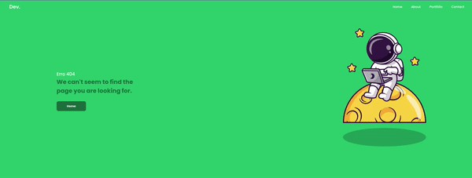

<h1 align="center">
  Landing Page Error 404
</h1>

  

  <a href="#-tecnologias">Tecnologias</a>&nbsp;&nbsp;&nbsp;|&nbsp;&nbsp;&nbsp;
  <a href="#-projeto">Projeto</a>&nbsp;&nbsp;&nbsp;|&nbsp;&nbsp;&nbsp;
  <a href="#memo-licença">Licença</a>

 
 
  

  

  

 

  

## 🚀 Tecnologias

Esse projeto foi desenvolvido com as seguintes tecnologias:
- JAVASCRIPT
- HTML
- CSS

## 🚧 Projeto:

Finalizado - para poder acessar o projeto, basta clicar no link a seguir: https://gabrielpcarvalho.github.io/Landing-Page-Error-404-page/

## 🎨 Inspiração:

Através de um desafio do canal [ DEV envolvente ](https://www.youtube.com/channel/UCHdeMKUsEdHYQo79So0kbTw).

## :memo: Licença

none

---

Feito com ♥ by GabrielPCarvalho

